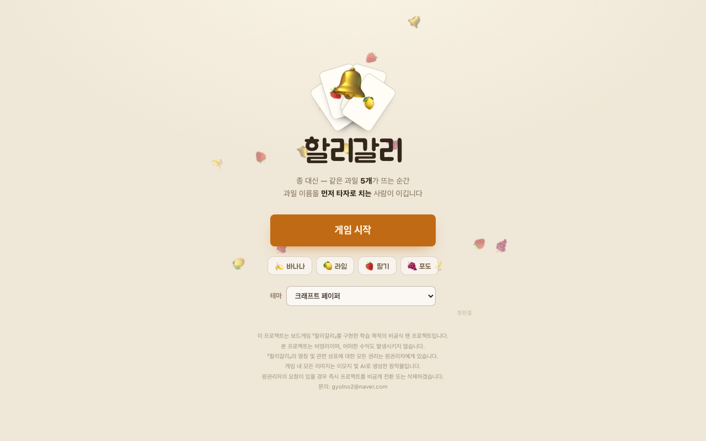

# 할리갈리

종을 치는 대신 **과일 이름을 먼저 타자로 치는** 사람이 판을 가져가는 온라인 할리갈리입니다.



## 플레이

https://halligalli.41ways.workers.dev/

2~6인. 사람이 모자라면 봇으로 채워서 혼자서도 할 수 있습니다.

## 규칙

카드 56장(바나나·라임·딸기·포도)을 나눠 갖고 돌아가며 한 장씩 깝니다. 펼쳐진 카드에서 같은 과일이 정확히 5개가 되는 순간, 그 과일 이름을 타자로 치는 사람이 판을 가져갑니다. 클릭이 아니라 오직 타자로만 칠 수 있고, 판정은 서버가 도착 순서로 매깁니다.

방 만들 때 **기본**(56장, 과일 하나만 세는 규칙)과 **익스트림**(72장, 조합·동물 카드로 조건이 달라지는 규칙) 중 고를 수 있습니다.

## 기술

정적 화면(`public/`)은 Cloudflare Workers 자산으로, 게임 로직은 Durable Object 하나가 웹소켓으로 처리합니다. 로컬 개발은 Node(`server.js`)로 같은 `game.js`를 띄웁니다.

```bash
npm install
npm start        # http://localhost:8788
npm test         # 서버를 켜 둔 채로
```

배포:

```bash
npx wrangler deploy
```

## 저작권

보드게임 『할리갈리』를 구현한 학습 목적의 비공식 팬 프로젝트입니다. 비영리이며 수익을 발생시키지 않습니다. 명칭과 상표에 대한 권리는 원권리자에게 있고, 게임 내 이미지는 이모지 및 AI로 만든 창작물입니다. 원권리자의 요청이 있으면 즉시 비공개 전환 또는 삭제합니다. 문의: gyolno2@naver.com
